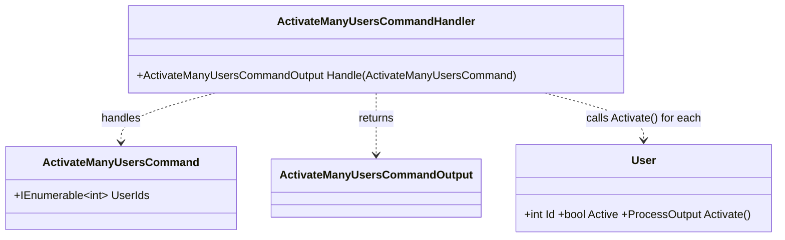

# ActivateManyUsersCommand

Description: Activate multiple users by a list of ids. Handler iterates domain `User.Activate()` for each target and aggregates results.

```mermaid
classDiagram
    class ActivateManyUsersCommand {
        +IEnumerable~int~ UserIds
    }
    class ActivateManyUsersCommandHandler {
        +ActivateManyUsersCommandOutput Handle(ActivateManyUsersCommand)
    }
    class ActivateManyUsersCommandOutput { }
    class User { +int Id +bool Active +ProcessOutput Activate() }

    ActivateManyUsersCommandHandler ..> ActivateManyUsersCommand : handles
    ActivateManyUsersCommandHandler ..> ActivateManyUsersCommandOutput : returns
    ActivateManyUsersCommandHandler ..> User : calls Activate() for each
```

