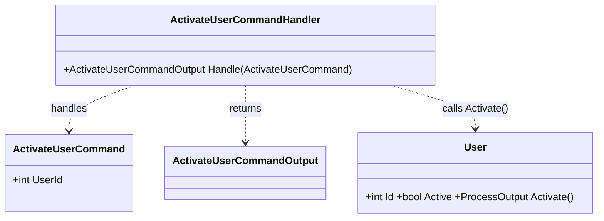

# ActivateUserCommand

Description: Activate a single user by id. Handler calls domain `User.Activate()` and returns an output describing success or errors.

```mermaid
classDiagram
    class ActivateUserCommand { +int UserId }
    class ActivateUserCommandHandler { +ActivateUserCommandOutput Handle(ActivateUserCommand) }
    class ActivateUserCommandOutput { }
    class User { +int Id +bool Active +ProcessOutput Activate() }

    ActivateUserCommandHandler ..> ActivateUserCommand : handles
    ActivateUserCommandHandler ..> ActivateUserCommandOutput : returns
    ActivateUserCommandHandler ..> User : calls Activate()
```

