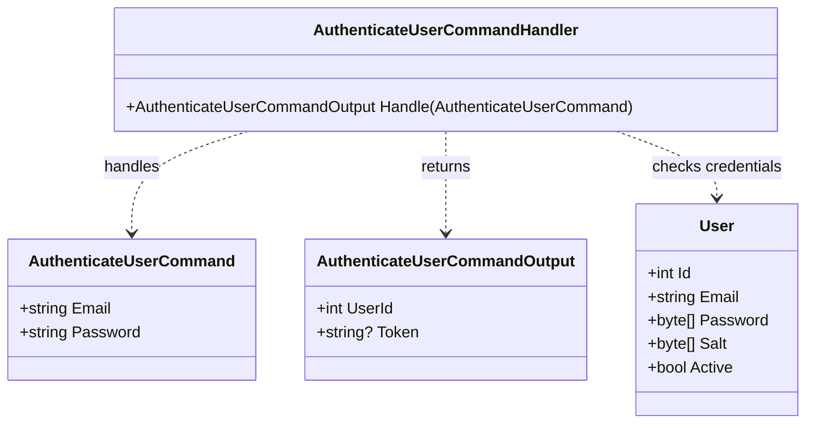

# AuthenticateUserCommand

Description: Authenticate a user using email and password. Handler validates credentials and returns an authentication output (user id and optional token).

```mermaid
classDiagram
    class AuthenticateUserCommand {
        +string Email
        +string Password
    }
    class AuthenticateUserCommandHandler {
        +AuthenticateUserCommandOutput Handle(AuthenticateUserCommand)
    }
    class AuthenticateUserCommandOutput {
        +int UserId
        +string? Token
    }
    class User {
        +int Id
        +string Email
        +byte[] Password
        +byte[] Salt
        +bool Active
    }

    AuthenticateUserCommandHandler ..> AuthenticateUserCommand : handles
    AuthenticateUserCommandHandler ..> AuthenticateUserCommandOutput : returns
    AuthenticateUserCommandHandler ..> User : checks credentials
```

