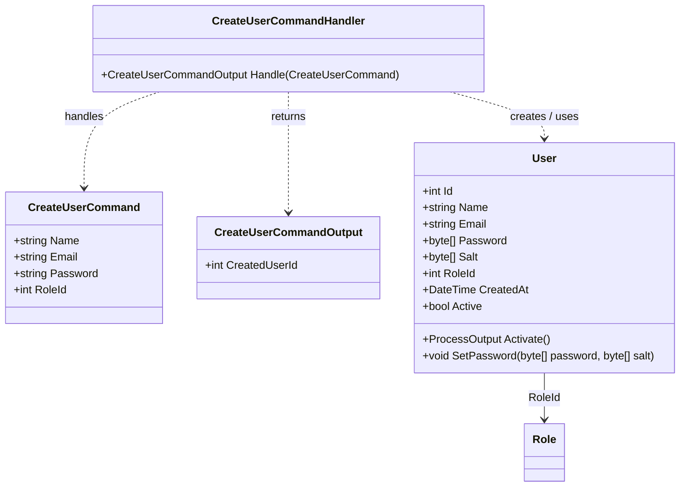

# CreateUserCommand

Description: Create a new user with name, email, password and role.

```mermaid
classDiagram
    class CreateUserCommand {
        +string Name
        +string Email
        +string Password
        +int RoleId
    }
    class CreateUserCommandHandler {
        +CreateUserCommandOutput Handle(CreateUserCommand)
    }
    class CreateUserCommandOutput {
        +int CreatedUserId
    }
    class User {
        +int Id
        +string Name
        +string Email
        +byte[] Password
        +byte[] Salt
        +int RoleId
        +DateTime CreatedAt
        +bool Active
        +ProcessOutput Activate()
        +void SetPassword(byte[] password, byte[] salt)
    }

    CreateUserCommandHandler ..> CreateUserCommand : handles
    CreateUserCommandHandler ..> CreateUserCommandOutput : returns
    CreateUserCommandHandler ..> User : creates / uses
    User --> Role : RoleId
```

