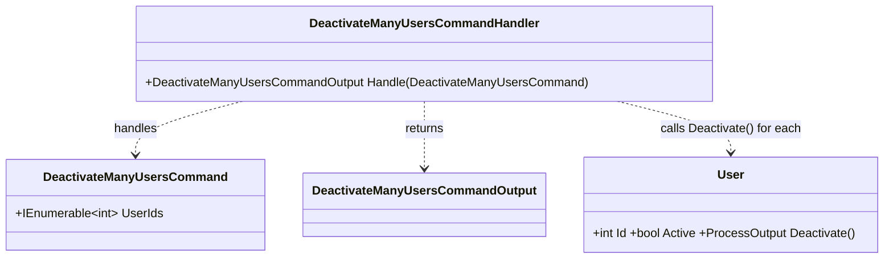

# DeactivateManyUsersCommand

Description: Deactivate multiple users by a list of ids. Handler iterates domain `User.Deactivate()` and aggregates
results.

```mermaid
classDiagram
    class DeactivateManyUsersCommand {
        +IEnumerable~int~ UserIds
    }
    class DeactivateManyUsersCommandHandler {
        +DeactivateManyUsersCommandOutput Handle(DeactivateManyUsersCommand)
    }
    class DeactivateManyUsersCommandOutput { }
    class User { +int Id +bool Active +ProcessOutput Deactivate() }

    DeactivateManyUsersCommandHandler ..> DeactivateManyUsersCommand : handles
    DeactivateManyUsersCommandHandler ..> DeactivateManyUsersCommandOutput : returns
    DeactivateManyUsersCommandHandler ..> User : calls Deactivate() for each
```

