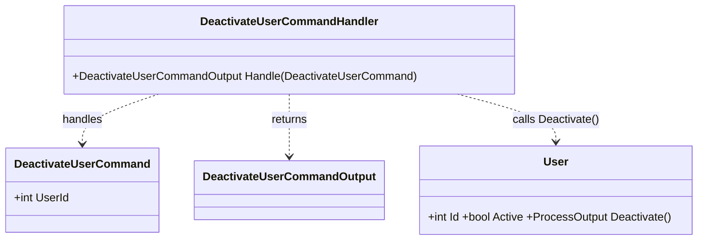

# DeactivateUserCommand

Description: Deactivate a single user by id. Handler calls domain `User.Deactivate()` and returns an output describing success or errors.

```mermaid
classDiagram
    class DeactivateUserCommand { +int UserId }
    class DeactivateUserCommandHandler { +DeactivateUserCommandOutput Handle(DeactivateUserCommand) }
    class DeactivateUserCommandOutput { }
    class User { +int Id +bool Active +ProcessOutput Deactivate() }

    DeactivateUserCommandHandler ..> DeactivateUserCommand : handles
    DeactivateUserCommandHandler ..> DeactivateUserCommandOutput : returns
    DeactivateUserCommandHandler ..> User : calls Deactivate()
```

