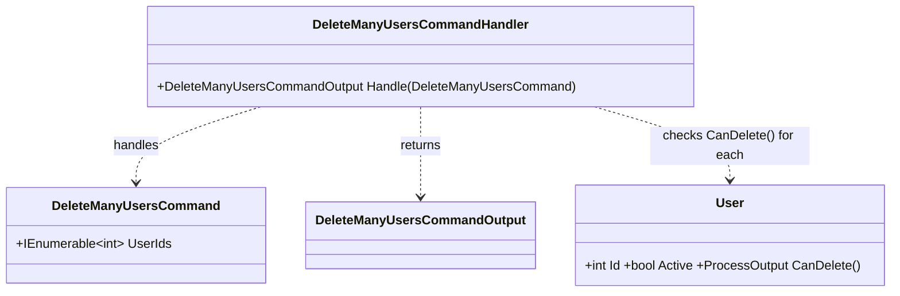

# DeleteManyUsersCommand

Description: Delete multiple users by a list of ids. Handler checks each `User.CanDelete()` and deletes those that pass,
aggregating results.

```mermaid
classDiagram
    class DeleteManyUsersCommand { +IEnumerable~int~ UserIds }
    class DeleteManyUsersCommandHandler { +DeleteManyUsersCommandOutput Handle(DeleteManyUsersCommand) }
    class DeleteManyUsersCommandOutput { }
    class User { +int Id +bool Active +ProcessOutput CanDelete() }

    DeleteManyUsersCommandHandler ..> DeleteManyUsersCommand : handles
    DeleteManyUsersCommandHandler ..> DeleteManyUsersCommandOutput : returns
    DeleteManyUsersCommandHandler ..> User : checks CanDelete() for each
```

