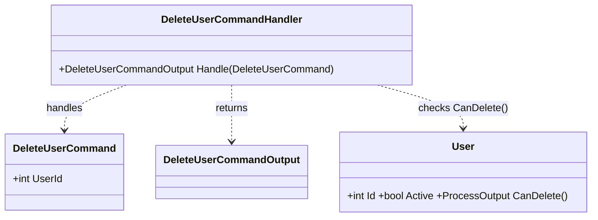

# DeleteUserCommand

Description: Delete a single user by id. Handler typically calls `User.CanDelete()` and then repository delete. The domain `User` exposes `CanDelete()` that enforces deletion rules.

