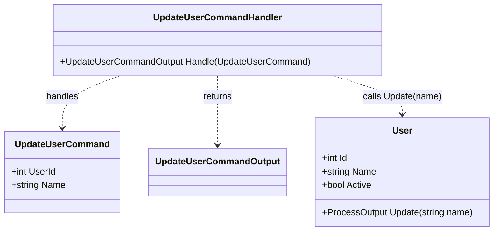

# UpdateUserCommand

Description: Update a user's basic data (name). Handler calls `User.Update(name)` and returns result.

```mermaid
classDiagram
    class UpdateUserCommand {
        +int UserId
        +string Name
    }
    class UpdateUserCommandHandler {
        +UpdateUserCommandOutput Handle(UpdateUserCommand)
    }
    class UpdateUserCommandOutput { }
    class User {
        +int Id
        +string Name
        +bool Active
        +ProcessOutput Update(string name)
    }

    UpdateUserCommandHandler ..> UpdateUserCommand : handles
    UpdateUserCommandHandler ..> UpdateUserCommandOutput : returns
    UpdateUserCommandHandler ..> User : calls Update(name)
```

