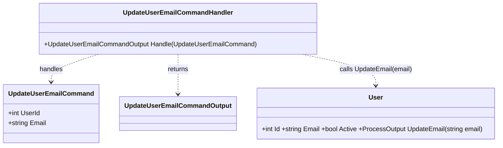

# UpdateUserEmailCommand

Description: Change a user's email. Handler calls `User.UpdateEmail(email)` and ensures uniqueness via repository
checks.

```mermaid
classDiagram
    class UpdateUserEmailCommand {
        +int UserId
        +string Email
    }
    class UpdateUserEmailCommandHandler {
        +UpdateUserEmailCommandOutput Handle(UpdateUserEmailCommand)
    }
    class UpdateUserEmailCommandOutput { }
    class User { +int Id +string Email +bool Active +ProcessOutput UpdateEmail(string email) }

    UpdateUserEmailCommandHandler ..> UpdateUserEmailCommand : handles
    UpdateUserEmailCommandHandler ..> UpdateUserEmailCommandOutput : returns
    UpdateUserEmailCommandHandler ..> User : calls UpdateEmail(email)
```

