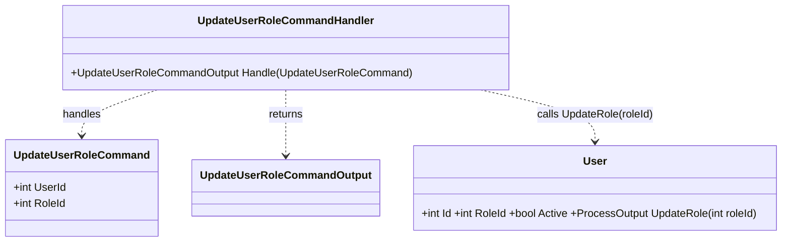

# UpdateUserRoleCommand

Description: Change a user's role. Handler calls `User.UpdateRole(roleId)` and ensures the new role id is valid.

```mermaid
classDiagram
    class UpdateUserRoleCommand {
        +int UserId
        +int RoleId
    }
    class UpdateUserRoleCommandHandler {
        +UpdateUserRoleCommandOutput Handle(UpdateUserRoleCommand)
    }
    class UpdateUserRoleCommandOutput { }
    class User { +int Id +int RoleId +bool Active +ProcessOutput UpdateRole(int roleId) }

    UpdateUserRoleCommandHandler ..> UpdateUserRoleCommand : handles
    UpdateUserRoleCommandHandler ..> UpdateUserRoleCommandOutput : returns
    UpdateUserRoleCommandHandler ..> User : calls UpdateRole(roleId)
```

