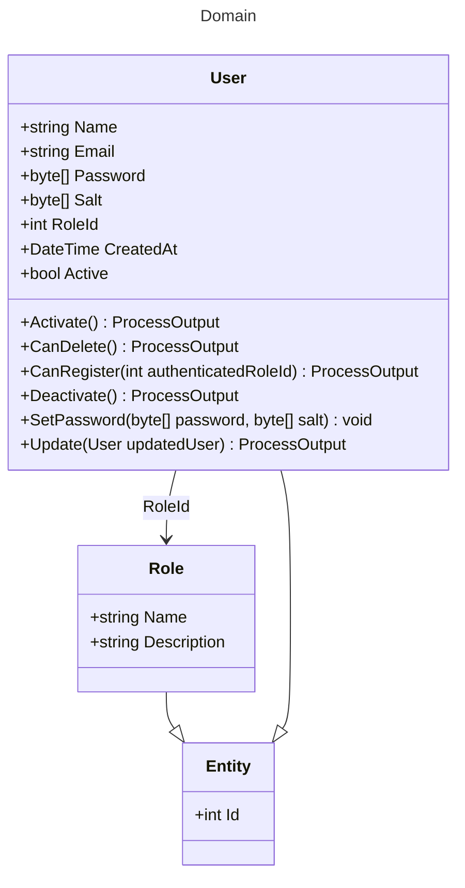

# Domain

Contains the core business logic and aggregates of the User Management API.

## Aggregates

- [User](../src/Core/ArturRios.UserManagement.Domain/Aggregates/User.cs)
    - Properties: Id (inherited), Name, Email, Password, Salt, RoleId, CreatedAt, Active
    - Key methods: Activate(), Deactivate(), CanDelete(), SetPassword(byte[] password, byte[] salt), Update(string
      name), UpdateEmail(string email), UpdateRole(int roleId)
    - Behavior: User enforces domain constraints via Condition checks before mutating state and returns a ProcessOutput
      describing success/failures.

- [Role](../src/Core/ArturRios.UserManagement.Domain/Aggregates/Role.cs)
    - Properties: Id (inherited), Name, Description

## Enums

- [Roles](../src/Core/ArturRios.UserManagement.Domain/Enums/Roles.cs)

## Repositories

- [IUserRepository](../src/Core/ArturRios.UserManagement.Domain/Repositories/IUserRepository.cs)
- [IUserRangeRepository](../src/Core/ArturRios.UserManagement.Domain/Repositories/IUserRangeRepository.cs)
- [IUserReadOnlyRepository](../src/Core/ArturRios.UserManagement.Domain/Repositories/IUserReadOnlyRepository.cs)

## Class Diagram

