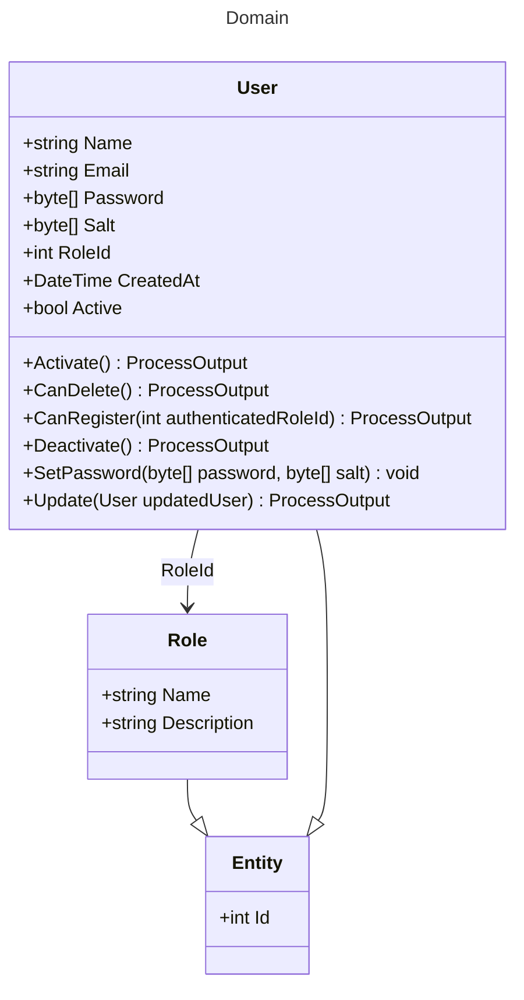

# Domain

Contains the core business logic and aggregates of the User Management API.

## Aggregates

- [Role](../src/Core/ArturRios.UserManagement.Domain/Aggregates/Role.cs)
- [User](../src/Core/ArturRios.UserManagement.Domain/Aggregates/User.cs)

## Enums

- [Roles](../src/Core/ArturRios.UserManagement.Domain/Enums/Roles.cs)

## Filters

- [UserFilter](../src/Core/ArturRios.UserManagement.Domain/Filters/UserFilter.cs)
- [UserMultiFilter](../src/Core/ArturRios.UserManagement.Domain/Filters/UserMultiFilter.cs)

## Repositories

- [IUserRepository](../src/Core/ArturRios.UserManagement.Domain/Repositories/IUserRepository.cs)

## Class Diagram

