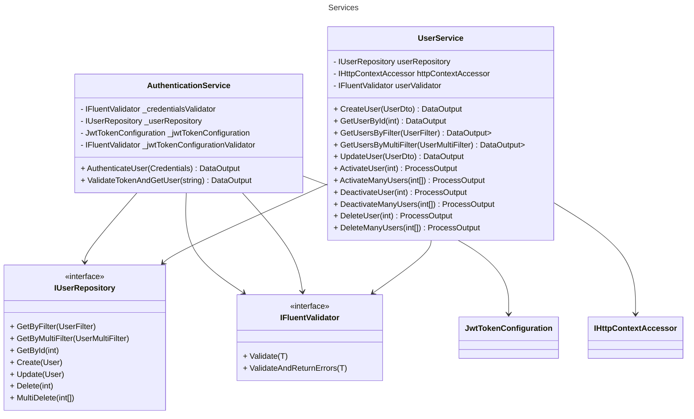

# Services

Layer that encapsulates domain business logic and orchestrates data flow between repositories and controllers.

- [AuthenticationService](../src/Core/ArturRios.UserManagement.Services/AuthenticationService.cs)
- [UserService](../src/Core/ArturRios.UserManagement.Services/UserService.cs)

## Class Diagram

